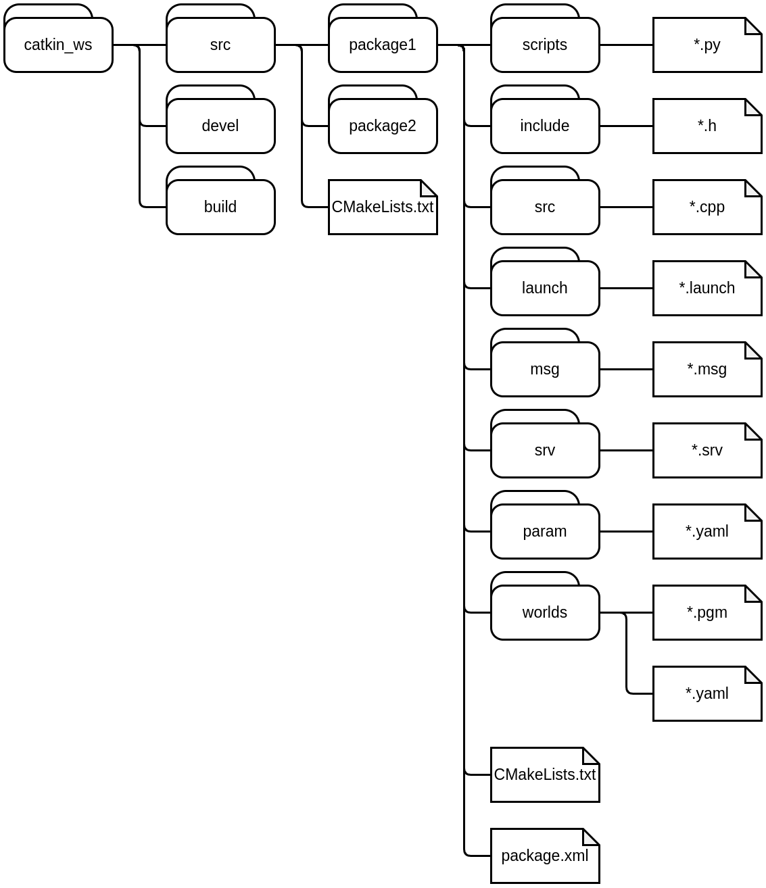
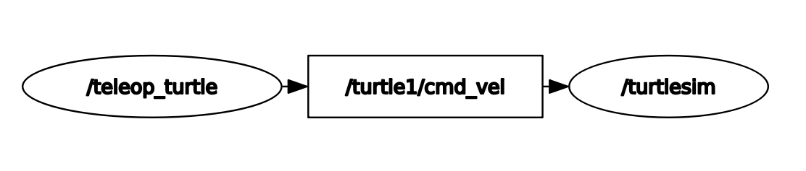

# АРХИТЕКТУРА ROS

Операционная система роботов (Robot Operating System) - это промежуточный программный пакет для робототехники с открытым исходным кодом. ROS предоставляет услуги, которые вы ожидаете от операционной системы, включая абстракцию оборудования, низкоуровневое управление устройствами, реализацию часто используемых функций, передачу сообщений между процессами и управление пакетами. Он также предоставляет инструменты и библиотеки для получения, построения, написания и запуска кода на нескольких компьютерах. Основная особенность ROS - это распределенная структура процессов (также называемых узлами), которая позволяет индивидуально разрабатывать исполняемые файлы и связывать их во время выполнения. Эти процессы можно сгруппировать в пакеты и стеки, которые можно легко совместно использовать и распространять. Такой дизайн, от уровня файловой системы до уровня сообщества, позволяет принимать независимые решения о разработке и внедрении.

## Файловая система

Файловая система определяет ресурсы, которые хранятся на диске. Выделены следующие элементы файловой системы ROS.

**Пакеты (Packages)** – набор логически связанных файлов. это основная единица организации программного обеспечения в ROS. Пакет может содержать процессы (узлы)  ROS, зависимую от ROS библиотеку, наборы данных, файлы конфигурации или что-либо еще, что удобно организовано вместе.

**Метапакеты (Metapackages)** - специализированные пакетамы, которые служат только для представления группы пакетов, связанной одной задачей.

**Манифест (Package manifest)** – это файл (package.xml), служащий для определения зависимостей между пакетами и содержащий данные о пакете (имя, версия, описание, зависимости).

**Сообщения (Message)**. Сообщения определяет структуру данных сообщения, передаваемого в ROS. 

**Сервисы (Service)**. Сервис определяет структуру данных запроса и ответа для сервиса.

Так как для сборки ROS пакетов используется специальная обертка, то очем важным является правельное расположение файлов и директорей вашей рабочей области.

| Название            | Описание |
| -                   | -        |
| scripts             | Эта папка содержит исполняемые файлы Python скриптов
| include             | Эта папка содержит все заголовочные файлы и библиотеки
| src                 | Эта папка содержит исходные код C++ программ
| launch              | Эта папка содержит файлы с расширением(.launch) для запуска одного или нескольких узлов ROS
| msg                 | Эта папка содержит пользовательские определения сообщений.
| srv                 | Эта папка содержит пользовательские определения сервисов.
| param               | Эта папка содержит все конфигурационные файлы необходимые для пакета
| worlds              | Эта папка содержит описание карты для навигационного стека
| package.xml         | Это файл манифеста пакета.
| CMakeLists.txt      | Это файл сборки CMake пакета.

## Граф вычислений

Граф вычислений - это одноранговая сеть(peer-to-peer networks) процессов ROS, совместно обрабатывающих данные. Основные концепции вычислительного графа ROS - это узлы (Nodes), мастер(Master), сервер параметров (Parameter Server), сообщения (messages),  сервисы (services), темы (topics) и мешки (bags), которые по-разному предоставляют данные графу.

Рассмотрим элементы графа подробнее

- [**Мастер (Master)**](http://wiki.ros.org/Master) Мастер ROS обеспечивает регистрацию имени и поиск остальной части графа вычислений. Без мастера узлы не смогут находить друг друга, обмениваться сообщениями  и вызывать службы.

- [**Узел (Node)**](http://wiki.ros.org/Nodes) Программный процессы, которые выполняют вычисления называют узлами.  Программа узла пишется с использованием библиотеки ROS, такой как roscpp или rospy. В роботе много узлов для выполнять различные виды задач. Используя методы связи ROS, он может связываться друг с другом и обмениваться данными. Одна из целей узлов ROS - создавать простые процессы, а не большой процесс со всеми функциями. Будучи простой структурой, узлы ROS легко отлаживать и модифицировать.
  
- [**Сообщения (Messages)**](http://wiki.ros.org/Messages) Узлы могут общаться друг с другом с помощью сообщений. Сообщение – это структура данных, включающая типизированные поля. Поддерживаются стандартные примитивные типы (integer, floating point, boolean и т.п.), а также массивы примитивных типов. Сообщения могут включать произвольно сложные структуры и массивы.
  
- [**Темы (Topics)**](http://wiki.ros.org/Topics) Сообщения в ROS организуются по темам. Идея состоит в том, что узел, который хочет передавать информацию, будет публиковать сообщения по соответствующей теме или темам. А узел, который хочет получать информацию, будет подписываться на интересующую тему или темы. Для одной темы может быть одновременно несколько узлов-источников (издателей) и узлов-получателей (подписчиков) информации. В целом издатели и подписчики не знают о существовании друг друга. Организацией взаимодействия между ними занимается мастер ROS. Каждая тема имеет имя, и каждый узел может подключиться к тема для отправки или получения сообщений.
  
- [**Сервисы (Services)**](http://wiki.ros.org/Services) Модель запрос/ответ выполняется через сервисы, которые определяются парой структур сообщения: одна для запроса и одна для ответа. Серверный узел предлагает сервис с именем, а клиент использует имя сервиса, отправляет сообщение с запросом и ожидая ответа.
  
- [**Логи (Bags)**](http://wiki.ros.org/Bags) формат сохранения и воспроизведения данных сообщений ROS. Логи  - важный механизм для хранения данных для отладки алгоритмов и поиска ошибок.

Мастер ROS действует как служба имен в графе вычислений ROS. В нем хранятся темы и информация о регистрации сервисов для узлов ROS. Узлы связываются с Мастером, чтобы сообщить свою регистрационную информацию. По мере того, как эти узлы связываются с мастером, они могут получать информацию о других зарегистрированных узлах и при необходимости устанавливать соединения. Мастер также будет выполнять обратные вызовы этим узлам при изменении этой регистрационной информации, что позволяет узлам динамически создавать соединения по мере запуска новых узлов.

Узлы подключаются к другим узлам напрямую. Мастер предоставляет только поисковую информацию, как DNS-сервер. Узлы, которые подписываются на тему, будут запрашивать соединения от узлов, которые публикуют эту тему, и будут устанавливать это соединение по согласованному протоколу соединения. Наиболее распространенный протокол, используемый в ROS, называется TCPROS, в котором используются стандартные сокеты TCP/IP.

Эта архитектура допускает независимую работу, где имена являются основным средством, с помощью которого могут быть построены более крупные и более сложные системы. Имена играют очень важную роль в ROS: все узлы, темы, службы и параметры имеют имена. Каждая клиентская библиотека ROS поддерживает переназначение имен в командной строке, что означает, что скомпилированную программу можно перенастроить во время выполнения для работы в другой топологии графа вычислений.

Для примера рассмотрим самый базовый случай:

В данном примере примере и последующих визуализациях ноды будут обозначаться как овалы, а топики прямоугольниками. В в данный момент графе запущенно две ноды `/teleop_turtle` и `/turtlesim`, связываются они с помощью топика `/turtle/cmd_vel` в который публикуются сообщения определенного типа. Этот пример более подробно расмотрен в упражнении [ex2](./ex1.ROS_nodes_and_topics.md).

## КОМАНДЫ ROS

Имена всех команд ROS начинаются с приставки ros, вторая часть имени команды отражает смысловое значение и часто
является копией команды в Linux. Например:

`roscd = ros + cd`

`rosls = ros + ls`

## Команды работы с файловой системой

`rospack` – получение информации о пакетах ROS. Реализует широкий спектр команд: размещение пакетов ROS в файловой
системе, поиск и перечисление доступных пакетов, вычисление
дерева зависимостей пакетов.

`roscd <packet_name>` – изменение директории с ис-
пользованием имени пакета.

`rosls <packet_name>` – вывод содержимого директории
пакета или списка пакетов.
В командной строке ROS работает завершение написания
команд с помощью клавиши Tab, как в Linux.

## Команды работы с узлами

`roscore` – запускает набор узлов и программ, которые требуются для работы ROS. При старте roscore запускаются: мастер ROS, сервер параметров ROS, узел журналирования (записи опроисходящих событиях) rosout.

`rosnode` – набор команд для вывода информации о узлах ROS, которые запущены в системе. Поддерживаются команды:

`rosnode info <node_name>` – вывод информации об узле `<node_name>`;

`rosnode kill <node_name>` – завершение работы узла `<node_name>`;

`rosnode list` – вывод списка активных узлов;

`rosnode cleanup` – удаление регистрационной информации обо всех узлах, которые недоступны на данный момент.

`rosrun <package_name> <executable_name>` – команда позволяет запустить исполняемый файл в произвольном
пакете из любого места без необходимости указания полного пути до этого пакета. Параметр `<package_name>` – имя пакета,
`<executable_name>` – имя исполняемого файла.

ROS требует, чтобы каждый узел имел уникальное имя.

## Команды работы с темами и зависимостями между узлами

Зависимости между узлами, запущенными в данный момент,
в виде графа вычислений можно посмотреть с помощью приложения `rqt_graph`. Утилита `rqt_graph` входит в фреймворк rqt.
Фреймворк rqt основан на Qt и используется для разработки графического интерфейса в ROS. Граф вычислений выводится в отдельном окне командой
`rosrun rqt_graph rqt_graph`

Команда `rostopic` позволяет получить информацию о темах в ROS. rostopic имеет следующий набор подкоманд:

`rostopic echo </topic_name>` – вывод потока данных, опубликованных в указанную тему;

`rostopic list </topic_name>` – вывод списка опубликованных тем с указанием издателей и подписчиков;

`rostopic type </topic_name>` – вывод типа сообщения для любой опубликованной темы.

`rosmsg show <message_data_type_name>`. Тип данных сообщения имеет составное имя, состоящее из имени пакета
и имени типа данных сообщения

`rostopic pub </topic_name> <message_name> <args>` – публикация данных в указанную тему. В параметрах
команды указывают имя темы, имя сообщения и аргументы, которые передаются в сообщении (зависят от параметров конкретного сообщения);

Для просмотра значений отдельных переменных выбранной
темы в виде графика, можно использовать утилиту `rqt_plot`'

Для просмотра изображения, можно использовать утилиту `rqt_image_view`.

`rosparam` – команда позволяет хранить и управлять данными на сервере параметров ROS. Сервер параметров работает
со следующими типами: целочисленные, с плавающей точкой,
булевы, словари и списки. Команда rosparam в качестве синтаксиса использует язык разметки YAML. Команда rosparam содержит
следующие подкоманды:
`rosparam list` – вывод списка имен параметров;

`rosparam get <parameter_name>` – получить значение параметра;

`rosparam set <parameter_name> <parameter_value>` – задать значение параметра;

`rosparam load <file_name>` – загрузить значения всех параметров из файла.

Команды работы с типами сообщений (файлы msg)

## Команды работы с типами сообщений (файлы msg)

`rosmsg` – команда получения информации о типах сообще-
ний ROS. rosmsg содержит следующие подкоманды:

`rosmsg list` – вывод всех сообщений всех пакетов;

`rosmsg show <message_data_type_name>` – вывод типа данных сообщения. Тип данных сообщения имеет составное имя, состоящее из имени пакета и имени типа данных сообщения
