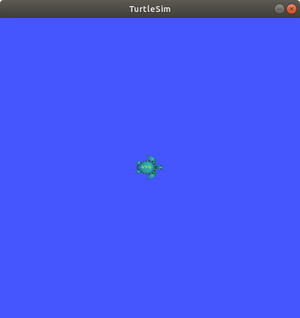
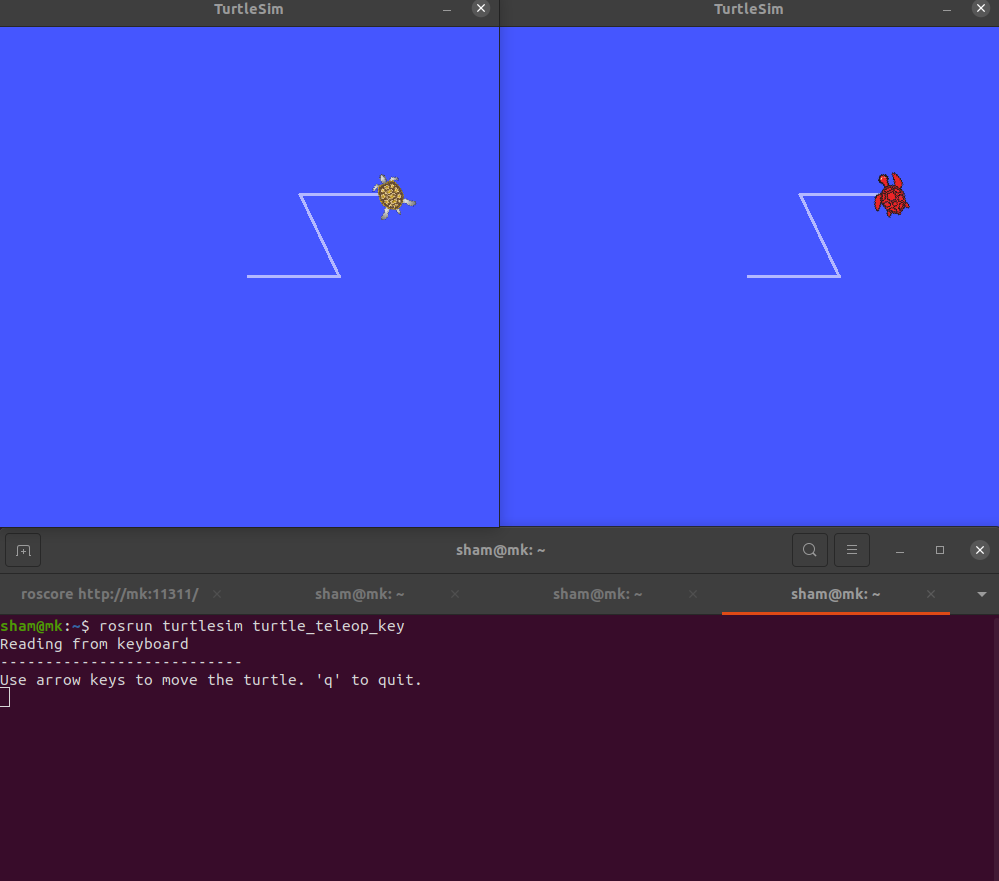
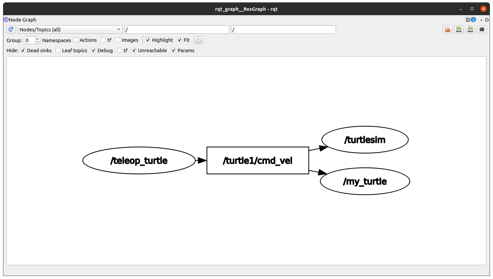
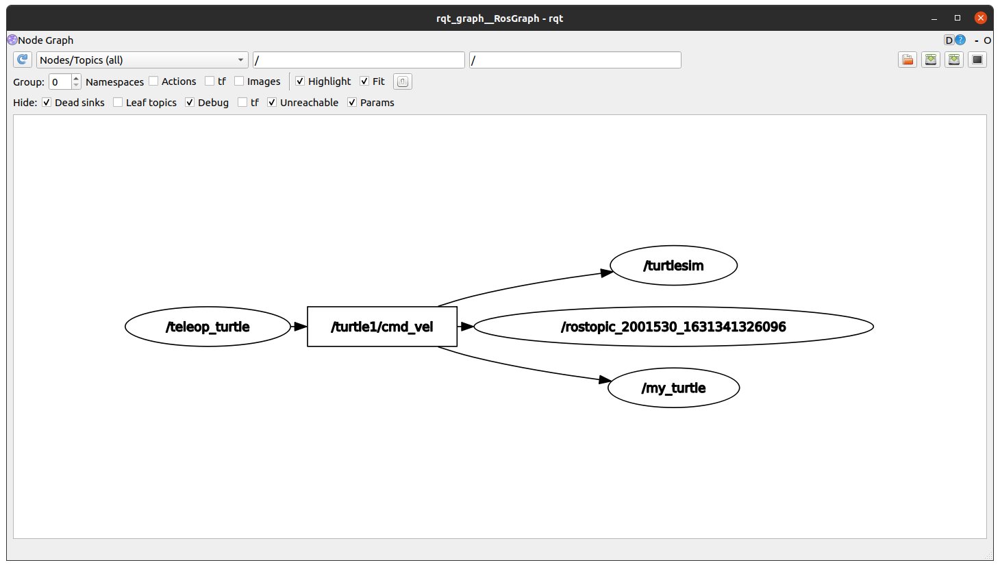
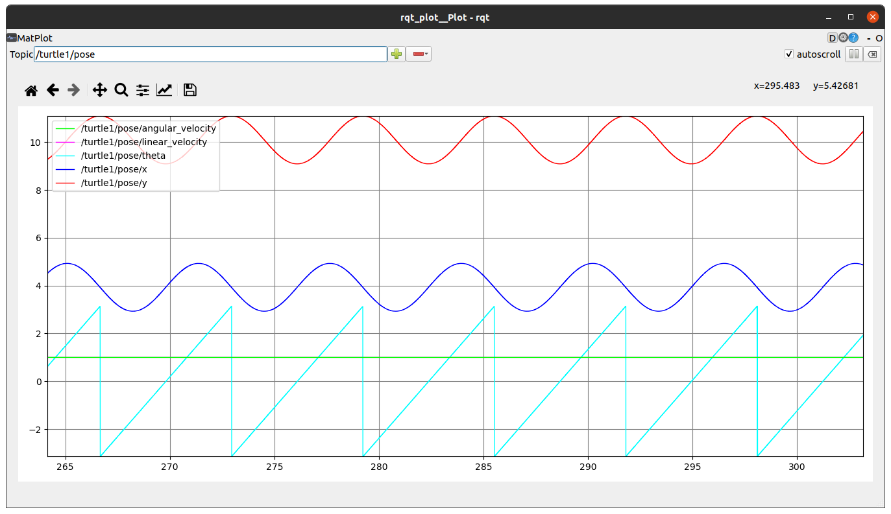

# Работа с узлами через терминал

Перед началом работы следует запустить мастер roscore. Его следует запускать каждый раз при начале работы.
В командной строке выполните команду:

```console
roscore
```

Запустите новый узел с помощью команды rosrun. Для примера воспользуемся пакетом симулятора черепахи
turtlesim. 

Откройте новую вкладку терминала сочетанием клавиш `Ctrl+Shift+T` и в командной строке выполните команду:

```console
rosrun turtlesim turtlesim_node
```

Будет выведена информация о запущенном узле и одновременно появится графическое окно с черепахой.



<div style="page-break-before:always;">
</div>

Если возникает необходимость запустить еще один узел turtlesim, то ROS не даст это сделать, так как в системе будет два узла с одинаковым именем, работа существующего узла будет прекращена, и будет создан новый узел.

Для создания еще одного узла с другим именем необходимо переопределить имя. В новом окне терминала выполните команду:

```console
rosrun turtlesim turtlesim_node __name:=my_turtle
```

Одним из примеров управления является ввод с клавиатуры, для запуска в новом окне терминала выполните команду:

```console
rosrun turtlesim turtle_teleop_key
```

Теперь с помощью стрелочек вы можете задавать скорости для черепашек. Если все команды были выполнены верно то черепашки должны передвигаться синхронно.



Открыв новое окно терминала и выполните команду:

```console
rqt_graph
```

Появится новое графическое окно с графом связей между
нодами, для наглядности поставьте галочку в меню настроек напротив поля `Dead skins`, данным действием отключим топики которые в данные момент не участвуют в обмене информации между нодами. В графе присутствует три узла: `/teleop_turtle` который публикует вводимое задающее воздействие в топик `/turtle1/cmd_vel`, две другие ноды `/turtlesim` и `/my_turtle` получают сообщение из этого топика. В зависимости от получаемых значений скорости, черепашка в каждом окне симулятора начинает движение.




Посмотреть, какие данные передаются через тему /turtle1/cmd_vel, можно с помощью команды (если перед командой  стоит знак `$`, то командой считать только эту строчку, все остальное это вывод данной команды):

```console
$ rostopic echo /turtle1/cmd_vel 

linear: 
  x: 2.0
  y: 0.0
  z: 0.0
angular: 
  x: 0.0
  y: 0.0
  z: 0.0
---
```

Данные будут выводится в терминал только при их обновлении. То есть необходимо начать движение черепашкой.

Если в данный момент открыть окно с графом связей между узлами и обновить содержимое окна, то будет видно, что появился еще один узел (rostopic_xxxx_xxхxx), подписанный на топик `/turtle1/cmd_vel`



Обмен информацией между узлами через темы происходит в виде сообщений. Сообщения должны иметь определенный тип, известный и узлу-издателю, и узлу-подписчику. Таким образом, тип темы определяется типом сообщений, которые в ней публикуются. Тип темы можно получить с помощью команды:

```console
$ rostopic type /turtle1/cmd_vel

geometry_msgs/Twist
```

<div style="page-break-before:always;">
</div>

Полную информацию о теме `/turtle1/cmd_vel` можно получить с помощью команды:

```console
$ rostopic info /turtle1/cmd_vel

Type: geometry_msgs/Twist
Publishers:
* /teleop_turtle (http://machine_name:35547/)
Subscribers:
* /turtlesim (http://machine_name:37930/)
* /rostopic_24776_1530557986993
(http://machine_name:41231/)
```

Тип темы по сути является типом сообщения, которое передается в этой теме. В данном случае тема использует тип сообщения `geometry_msgs/Twist`. Имя сообщения состоит из двух частей: имя_пакета/имя_типа. Таким образом, тема `/turtle1/cmd_vel` использует тип сообщения под именем Twist из пакета geometry_msgs. Информацию о типе сообщения можно получить с помощью команды rosmsg

```console
$ rosmsg show geometry_msgs/Twist

geometry_msgs/Vector3 linear
float64 x
float64 y
float64 z
geometry_msgs/Vector3 angular
float64 x
float64 y
float64 z
```

Сформируем сообщение для темы `/turtle1/cmd_vel` с помощью команды

```console
rostopic pub /turtle1/cmd_vel geometry_msgs/Twist "linear:
  x: 1.0
  y: 0.0
  z: 0.0
angular:
  x: 0.0
  y: 0.0
  z: 1.0" 
```

<div style="page-break-before:always;">
</div>

Видим что черепашка пройдя определенное расстояние остановилась, это следствие того, что сообщение было опубликовано 1 раз, для постоянной отправки сообщений через <nobr>`rostopic pub`</nobr> добавить флаг -r (rate) со значением частоты отправки сообщений в герцах.

```console
rostopic pub -r 50 /turtle1/cmd_vel geometry_msgs/Twist "linear:
  x: 1.0
  y: 0.0
  z: 0.0
angular:
  x: 2.0
  y: 0.0
  z: 0.0" 
```

Черепашка теперь не останавливается.

rqt_plot отображает временную диаграмму данных, опубликованных по темам. Здесь мы будем использовать `rqt_plot` для построения данных, публикуемых в теме `/turtle1/pose`. Запустите `rqt_plot`.

```console
rqt_plot
```

В поле Topic введите интересующий вас топик, в данном случае это `/turtle1/pose` и нажмите зеленый плюс на панеле меню, теперь данные должны отображаться в реальном времени. Нажав на эконку дома расположенненного на панеле управления, график примет более призентабельный вид.



