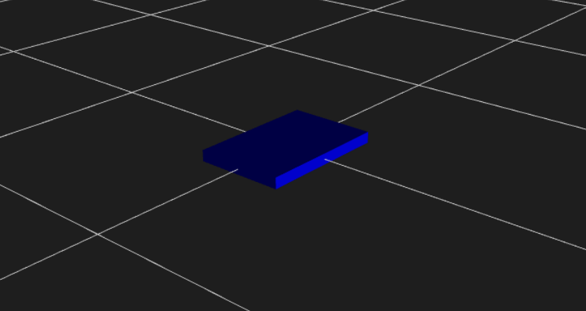
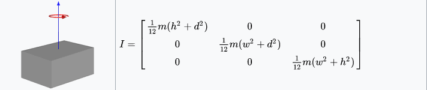
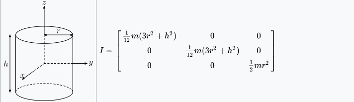
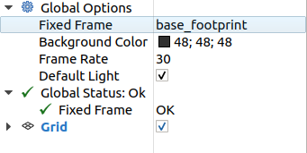
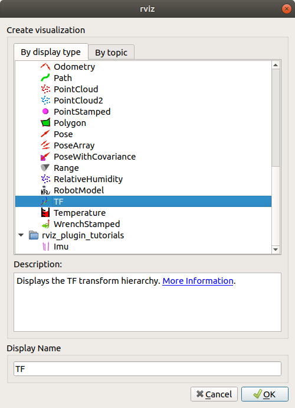
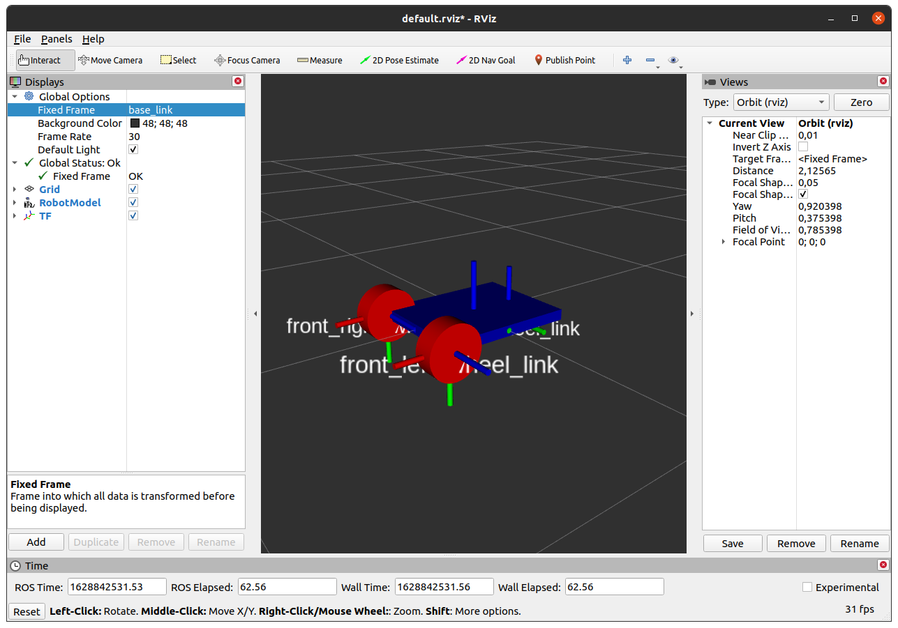

# Визуализация мобильной платформы 

## ROS tf

tf - это пакет, который позволяет пользователю отслеживать несколько координат с течением времени. tf поддерживает взаимосвязь между координатами в древовидной структуре, буферизованной во времени, и позволяет пользователю преобразовывать точки, векторы и т.д. между любыми двумя координатами в любой желаемый момент времени.

tf структуру  можно публиковать и читать програмно, но удобней создать визуальную модель робота с помощью URDF разметки.

## ROS URDF

URDF - это пакет который содержит ряд спецификаций XML для моделей роботов, датчиков, сцен и т.д.

Для описания робота создадим новый пакет в рабочем воркспейсе

```console
cd ~/catkin_ws/src
catkin_create_pkg bot_description
```

Все URDF файлы должны лежать в соответствующей директории пакета. Создадим ее командой

```console
cd ~/catkin_ws/src/bot_description
mkdir urdf
```

В созданной директории создадим файл с URDF описанием

```console
cd ~/catkin_ws/src/bot_description/urdf
touch description.xacro
```

Приступим к его редактированию. Внутри данного тега будет лежать все описание

```xml
<robot name="bot" xmlns:xacro="http://wiki.ros.org/xacro">

</robot>
```

<div style="page-break-before:always;">
</div>

Для начала создадим базу робота `base_link`, узел откуда будет рассчитываться одометрия `base_footprint`(должен располагаться под будущей колесной базой), а также материалы для окрашивания.

Для соединения `base_footprint` с `base_link` воспользуемся тегом `<joint>`

```xml
  <!-- материалы для окрашивания -->
  <material name="blue">
      <color rgba="0 0 0.8 1"/>
  </material>
  <material name="red">
      <color rgba="1 0 0 1"/>
  </material>

  <link name="base_footprint"/>

  <link name="base_link">
    <visual>
      <geometry>
        <box size="0.6 0.4 0.02"/>
      </geometry>
      <material name="blue"/>
    </visual>
  </link> 

  <!-- Название с типом соединения -->
  <joint name="base_footprint_to_base_link" type="fixed">
    <!-- перемещения и вращения в радианах относительно центра родительского элемента-->
    <origin xyz="-0.2 0 0 " rpy="0 0 0"/>
    <parent link="base_footprint"/>
    <child link="base_link"/>
  </joint>
```

Для предпросмотра в редакторе кода VSCODE необходимо нажать комбинацию клавиш `Ctrl+Shift+P` и в выпавшем окне выбрать  `ROS: Preview URDF`. В открывшейся вкладке будет отображаться визуальное представление создаваемой платформы. 



Пока что это просто прямоугольник, а так как мы планировали использовать данную модель в симуляторе, то необходимо определить момент инерции и границы соприкосновения. Для этого добавим теги в `base_link`

```xml
  <link name="base_link">
    <visual>
      <geometry>
        <box size="0.6 0.4 0.02"/>
      </geometry>
       <material name="blue"/>
    </visual>
    <collision>
      <geometry>
        <box size="0.6 0.4 0.02"/>
      </geometry>
    </collision>
    <inertial>
      <mass value="0.06"/>
      <inertia  ixx="0.01" ixy="0.0"  ixz="0.0" 
                           iyy="0.01" iyz="0.0"
                                      izz="0.01"/>
    </inertial>
  </link>
```

<div style="page-break-before:always;">
</div>

Так для расчета момента инерции воспользовались формулами



<!-- добавить расчет цилиндра -->

В данном описании также воспользуемся макроязыком xacro. Подробнее о возможностях можно узнать тут http://wiki.ros.org/xacro. Теперь для расчета инерции добавим заготовленный файл с макросами  `inertial.xacro` (который должен лежать в папке urdf пакета) в текущее описание, а также заменим инерцию базы робота на макрос из этого файла.

После изменений, описание должно выглядеть так

```xml

<robot name="bot" xmlns:xacro="http://wiki.ros.org/xacro">
  <xacro:include filename="$(find bot_description)/urdf/inertials.xacro"/>

  <material name="blue">
    <color rgba="0 0 0.8 1"/>
  </material>
  <material name="red">
    <color rgba="1 0 0 1"/>
  </material>

  <link name="base_footprint"/>

  <link name="base_link">
    <visual>
      <origin xyz="0 0 0" rpy="0 0 0" />
      <geometry>
        <box size="0.6 0.4 0.02" />
      </geometry>
      <material name="blue"/>
    </visual>

    <collision>
      <origin xyz="0 0 0" rpy="0 0 0"/>
      <geometry>
        <box size="0.6 0.4 0.02" />
      </geometry>
    </collision>

    <xacro:solid_cuboid_inertial
      rpy="0 0 0" xyz="0 0 0" mass="0.06" x="0.6" y="0.4" z="0.02"
    />
  </link>

  <joint name="base_footprint_to_base_link" type="fixed">
    <origin xyz="-0.2 0 0 " rpy="0 0 0"/>
    <parent link="base_footprint"/>
    <child link="base_link"/>
  </joint>

</robot>
```

Добавим переднее левое колесо

```xml
  <link name="front_left_wheel_link">
    <visual>
      <origin xyz="0 0 0" rpy="0 0 0" />
      <geometry>
        <cylinder radius="${wheel_radius}" length="0.08"/>
      </geometry>
      <material name="red"/>
    </visual>

    <collision>
      <origin xyz="0 0 0" rpy="0 0 0"/>
      <geometry>
        <cylinder radius="${wheel_radius}" length="0.08"/>
      </geometry>
    </collision>

    <xacro:solid_cylinder_inertial
      rpy="0 0 0" xyz="0 0 0" mass="0.1" radius="${wheel_radius}" length="0.08"
    />
  </link>

  <joint name="base_to_front_left_wheel_joint" type="continuous">
    <origin xyz="0.2 0.2 0" rpy="-1.57 0 0 "/>
    <parent link="base_link"/>
    <child link="front_left_wheel_link"/>
    <!-- ось вращения -->
    <axis xyz="0 0 1"/>
  </joint>
```

По аналогии добавим переднее правое колесо.

Добавим заднее колесо

```xml
<link name="back_wheel_link">
  <visual>
    <origin xyz="0 0 0" rpy="0 0 0" />
    <geometry>
      <sphere radius="0.04"/>
    </geometry>
    <material name="red"/>
  </visual>

  <collision>
    <origin xyz="0 0 0" rpy="0 0 0"/>
    <geometry>
      <sphere radius="0.04"/>
    </geometry>
  </collision>

  <xacro:solid_sphere_inertial
  rpy="0 0 0" xyz="0 0 0" mass="0.02" radius="0.04"
  />
  </link>

<joint name="base_link_to_back_wheel_link" type="fixed">
  <origin xyz="-0.2 0 -0.04" rpy="0 0 0 "/>
  <parent link="base_link"/>
  <child link="back_wheel_link"/>
</joint>
```

Вследствие чего получим модель мобильного робота.


Данная модель робота позволит публиковать положения сочленения робота робота в tf2 с помощью пакета `robot_state_publisher`. После публикации состояния оно становится доступным для всех компонентов системы, которые также используют tf2. Пакет принимает углы суставов робота в качестве входных данных и публикует трехмерные позы связей робота, используя кинематическую древовидную модель робота.

Для загрузки в пространство ROS необходимо создать загрузочный файл с расширением `.launch`. Обычно все файлы такого формата располагающийся в папке `launch` корневой папке пакета.

Создадим такой файл `description.launch` в котором пропишим путь до нашей модели, обработаем её как модель описания робота и запустим узел с публекантом tf2 преобразований.

```xml
<launch>
  <arg name="model" default="$(find bot_description)/urdf/bot_description.urdf"/>

  <param name="robot_description" command="$(find xacro)/xacro $(arg model)" />
  
  <node name="joint_state_publisher" pkg="joint_state_publisher" type="joint_state_publisher" />
  <node name="robot_state_publisher" pkg="robot_state_publisher" type="robot_state_publisher" />
</launch>
```

Для запуска в окне терминала пропишим

```console
roslaunch bot_description description.launch
```

Далее для визуализации познакомимся с rviz

Утилита RVIZ визуализирует данные, получаемые роботом с различных датчиков,а также модель робота и воссоздает решаемые роботом задачи.

Для запуска необходимо в новом окне терминала ввести команду

```console
rviz
```

<div style="page-break-before:always;">
</div>

Для работы необходимо в меню `Fixed frame` выбрать координату отсчета tf2 преобразований, в нашем случае это `base_link`.



Добавим модули для визуализации, для этого нажмём кнопку `Add` и в выпавшем окне выберем `TF`,а после выберем `RobotModel`.



<div style="page-break-before:always;">
</div>

Получим модель робота с координатами преобразований tf


