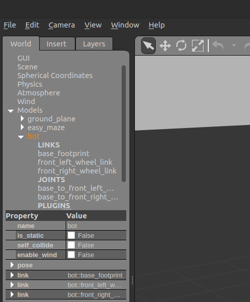

# Управление мобильной платформой

В данной работе вам предстоит найти выход из лабиринта задавая угловую и линейную скорости вашей мобильной платформы, при этом обрабатывая информацию о дальности до объектов и пройденном пути, получаемою с помощью лидара и одометрии соответственно.

В данной работе можно использовать мобильную платформу, разрабатываемого вами в предыдущих упражнениях, либо воспользоваться готовой платформой. Просмотреть пакет можно по ссылке <https://github.com/shamoleg/bot_description>

## Установка пакета с готовой мобильной платформой

Перед началом вам необходимо установить git с помощью команды в окне терминала

```console
sudo apt-get install git
```

После успешной установки необходимо перейти в папку с пакетами воркспейса

```console
cd ~/catkin_ws/src
```

**ВАЖНО!** Перед тем как скачать готовый пакет убедитесь в отсутствии пакета с таким же именем: `bot_description` . Если такой пакет существует, то вы можете перенести его в домашнюю папку командой

```console
mv bot_description ~/
```

Теперь вы готовы скачать пакет, для этого выполните команду

```console
git clone https://github.com/shamoleg/bot_description.git
```

Перейдите в воркспейс и соберите проект, для этого выполните последовательно команды

```console
cd ~/catkin_ws
catkin_make
```

Теперь вы готовы приступить к заданию!

<div style="page-break-before:always;">
</div>

## Запуск мира 

Для запуска мира с лабиринтом вам необходимо в окне терминала выполнить команду

```console
roslaunch bot_description eazy_maze_world.launch
```

Для спавна мобильной платформы в новом окне терминала выполнить команду

```console
roslaunch bot_description bot_gazebo.launch
```

Для запуска скрипта в новом окне терминала выполнить команду

```console
rosrun bot_description control.py
```

<div style="page-break-before:always;">
</div>

## Перезапуск мобильной платформой

Чтобы заново заспавнить робота необходимо удалить его из симуляции. Для этого выделите робота кликнув по модели или выбрав его в меню, как показано на рисунке. После этого нажмите клавишу `Del`



Также необходимо остановить ноды, в терминале где вы спавнили робота, сочетанием клавиш <nobr>`Ctrl + C`<nobr>

Теперь можно заново спавнить робота командой

```console
roslaunch bot_description bot_gazebo.launch
```