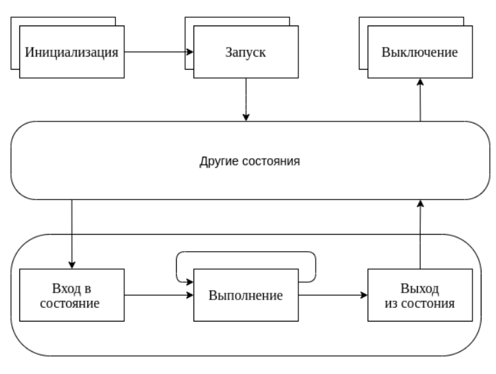

## FlexBE

FlexBE помогает создавать сложные модели поведения роботов без необходимости их кодирования вручную. Конечные автоматы, основанные на базовых возможностях, которые объединяют стандартные функции или особенности вашей системы, могут быть легко созданы с помощью предоставленного редактора перетаскивания. Впоследствии, используя тот же графический интерфейс, можно запустить и контролировать выполнение. Основываясь на концепции совместной автономии, оператор может влиять на выполнение во время выполнения, например, форсируя переходы, и робот может запросить помощь или подтверждение у оператора, если это необходимо. Во время выполнения возможна даже полная модификация структуры поведения.



Основные методы присутствующие в каждом состоянии:
- Инициализация, метод где происходит объявление названия состояния, переменных и перечисление возможных переходов в другие состояния.
- Выполнение, метод который постоянно вызывается во время выполнения. Основная цель - это проверка состояние выполняемого процесса и запуск перехода в другие состояния в зависимости от результата.

<div style="page-break-before:always;">
</div>

Методы обратного вызова, не обязательные для создания состояния:
- Запуск, выполняется свою логику при старте всей системы состояний.
- Выключение, запускается при остановки всей системы состояний.
- Вход в состояние, этот метод запускается, когда состояние становится активным, то есть происходит переход из другого состояния в это. Он в основномиспользуется для запуска действий, связанных с этим состоянием, или инициализации переменных, которые могли измениться во время предыдущего выполнения.
- Выход из состояния , этот метод инициируется, при переходе в другое состояние. Используется для остановки запущенных процессов.

Загрузку и установку FlexBE можно выполнить всего за несколько шагов. Сам движок доступен как в виде двоичной установки на сервере сборки ROS, так и в виде исходного кода на github. Вы можете получить его следующим способом:

```console
cd ~/catkin_ws/src
git clone https://github.com/team-vigir/flexbe_behavior_engine.git
```

FlexBE поставляется с обширным пользовательским интерфейсом, обеспечивающим удобный редактор поведения перетаскивания в сочетании с полезным мониторингом времени выполнения. Этот пользовательский интерфейс, приложение FlexBE, основано на платформе NWJS и может быть клонирован следующим образом. Необходимые двоичные файлы NWJS будут автоматически загружены в репозиторий при первой сборке.

```console
cd ~/catkin_ws/src
git clone https://github.com/FlexBE/flexbe_app.git
```

Поскольку FlexBE поощряет повторное использование состояний и поведения, рекомендуется также загрузить несколько уже существующих. Хорошей отправной точкой является generic_flexbe_states, набор из нескольких многоцелевых интерфейсов FlexBE для часто используемых компонентов ROS. 

```console
cd ~/catkin_ws/src
git clone https://github.com/FlexBE/generic_flexbe_states.git
```

```console
cd ~/catkin_ws
catkin_make
source devel/setup.bash
```

Вы можете создать свой собственный репозиторий для развития состояний и поведения, используя следующий подготовленный скрипт. Рекомендуется использовать этот сценарий, особенно когда вы впервые используете FlexBE. Обязательно выполните его в папке /src рабочего пространства catkin. В качестве имени проекта выберите что-то конкретное для проекта и не используйте такие термины, как «flexbe» или «поведение» (они будут добавлены автоматически, если это целесообразно).

```console
cd ~/catkin_ws/src
rosrun flexbe_widget create_repo bot
```

Для запуска поведенческого движка с графической оболочкой выполните команду:

```console
cd ~/catkin_ws/src
roslaunch flexbe_app flexbe_full.launch
```

