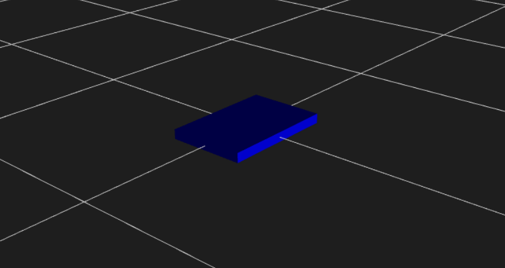
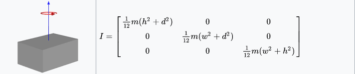
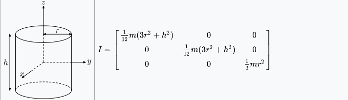
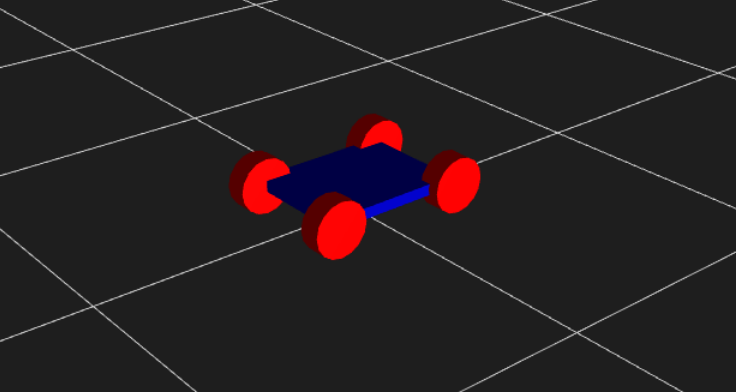
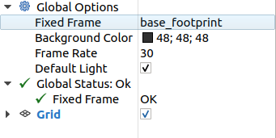
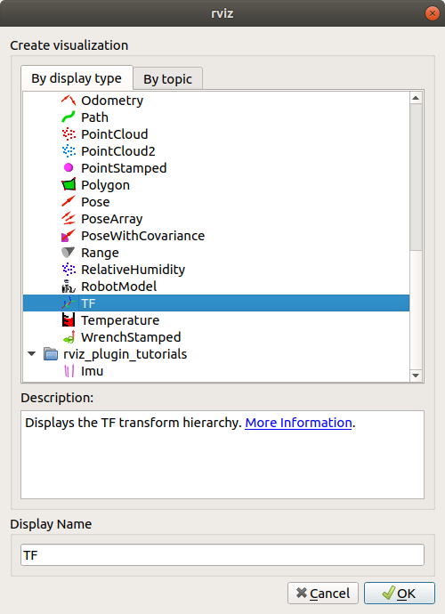
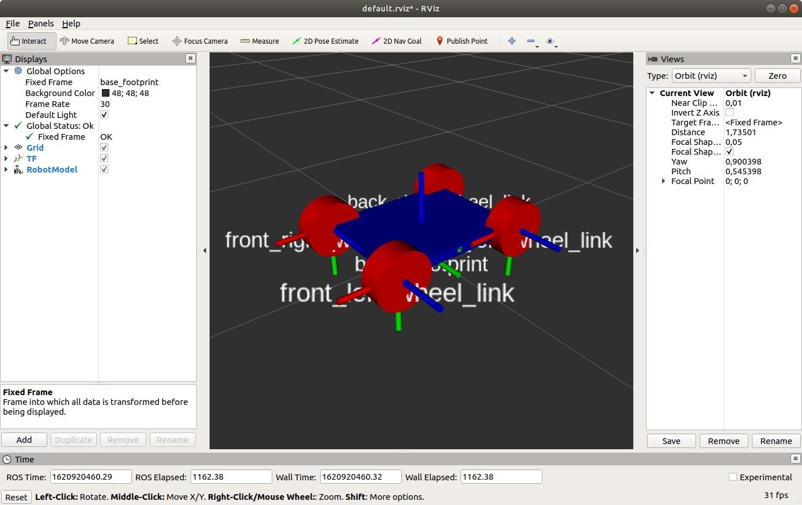

# tf

tf - это пакет, который позволяет пользователю отслеживать несколько координат с течением времени. tf поддерживает взаимосвязь между координатами в древовидной структуре, буферизованной во времени, и позволяет пользователю преобразовывать точки, векторы и т. д. между любыми двумя координатами в любой желаемый момент времени.

/TODO вставить картинку дерева tf

tf структуру  можно публиковать и читать програмно, но удобней создать визуальную модельробота с помощью URDF разметки.

URDF это пакет содержит ряд спецификаций XML для моделей роботов, датчиков, сцен и т.д.

Для начала создадим базу робота.

```xml
<?xml version="1.0"?>
<robot name="coursebot">
  <material name="blue">
      <color rgba="0 0 0.8 1"/>
  </material>
  <material name="red">
      <color rgba="1 0 0 1"/>
  </material>

  <link name="base_link">
    <visual>
      <geometry>
        <box size="0.6 0.4 0.05"/>
      </geometry>
      <material name="blue"/>
    </visual>
  </link>
</robot>
```

Для предпросмотра необходимо зажать комбинацию клавиш `Ctrl+Shift+P` получим синий прямоугольник



Покачто это просто прямоугольник, а так как мы планировали использовать данную модель в симуляторе, то необходимо определить момент энерции и грацницы соприкосновения. Для этого добавим теги в `base_link`

```xml
  ...
  <link name="base_link">
    <visual>
      <geometry>
        <box size="0.6 0.4 0.05"/>
      </geometry>
       <material name="blue"/>
    </visual>
    <collision>
      <geometry>
        <box size="0.6 0.4 0.05"/>
      </geometry>
    </collision>
    <inertial>
      <mass value="10"/>
      <inertia ixx="0.4" ixy="0.0" ixz="0.0" iyy="0.4" iyz="0.0"
      izz="0.2"/>
    </inertial>
  </link>
  ...
```

так для расчета момента энерции воспользовались формулами




Добавим колесо

```xml
  ...
  <link name="front_right_wheel">
    <visual>
      <geometry>
        <cylinder length="0.06" radius="0.06"/>
      </geometry>
    </visual>
  </link>

  <joint name="base_to_front_right_wheel" type="fixed">
    <parent link="base_link"/>
    <child link="front_right_wheel"/>
    <origin xyz="0.16 0.15 -0.02" rpy="0 0 1.57"/>
    <axis xyz="0 0 1"/>
  </joint>
  ...
```

По аналогии добавим остальные колёса и получим модель мобильного робота.



Данная модель робота позволит публиковать состояние робота в tf2 с помощью пакета robot_state_publisher. После публикации состояния оно становится доступным для всех компонентов системы, которые также используют tf2. Пакет принимает углы суставов робота в качестве входных данных и публикует трехмерные позы связей робота, используя кинематическую древовидную модель робота.

Для загрузки в пространство ROS необходимо создать загрудочный файл с расширением `.launch`. Обычно все файлы такого формата распологаются в папке `launch` корневой папке пакета.

Создадим такой файл `description.launch` в котором пропишим путь до нашей модели, обработаем её как модель описания робота и запустим узел с публекантом tf2 преобразований.

```xml
<launch>
  <arg name="model" default="$(find coursebot_description)/urdf/coursebot.urdf"/>

  <param name="robot_description" command="$(find xacro)/xacro $(arg model)" />
  
  <node name="joint_state_publisher" pkg="joint_state_publisher" type="joint_state_publisher" />
  <node name="robot_state_publisher" pkg="robot_state_publisher" type="robot_state_publisher" />
</launch>
```

Для запуска в окне терминала пропишим

```console
roslaunch coursebot_description description.launch
```

Далее для визуализации познакомимся с rviz

Утилита RVIZ визуализировать данные, получаемые роботом с различных датчиков,  модель робота, воссоздать решение роботом задачи.

Для запуска необходимо в новом окне терминала ввести команду

```console
rviz
```

Для работы необходимо в меню `Fixed frame` выбрать координату очета tf2 преобразований, в нашем случае это `base_link`.



Добавим модули для визуализации, для это нажмём кнопу `Add` и в выпавшем окне выберим `TF`,а после выберим `RobotModel`.



Получим модель робота с координатами преобразований tf2

/TODO change image

